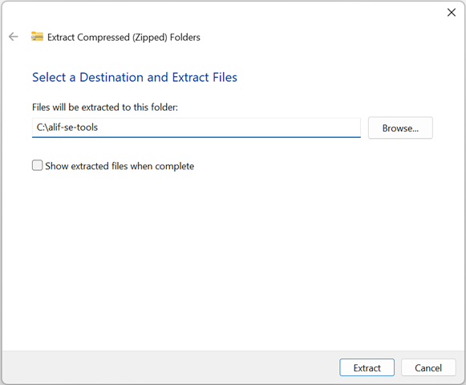
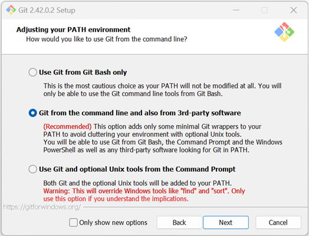
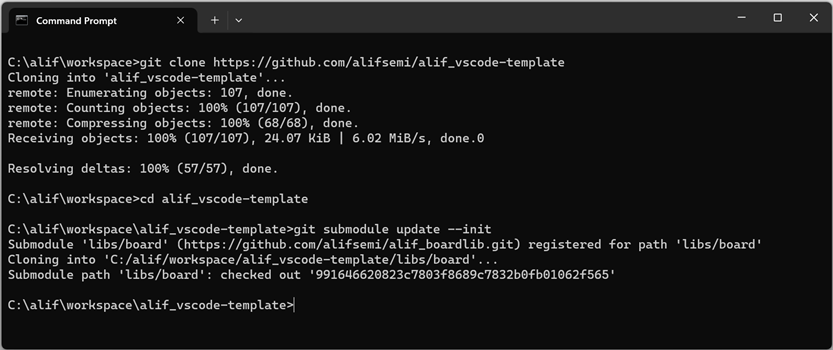
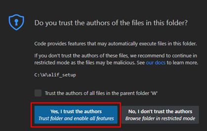
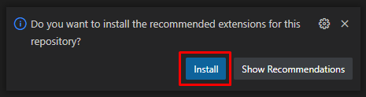
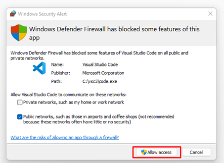
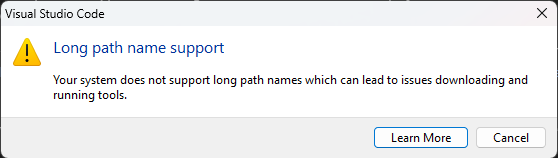
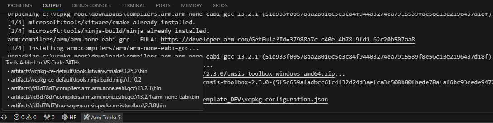
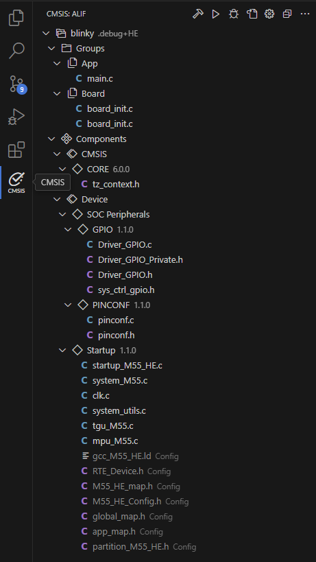
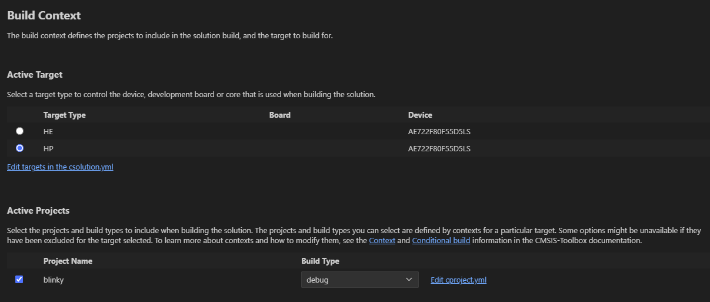

# Getting Started with VSCode CMSIS pack project 

This guide shows how to set up a VS Code environment with the Arm GNU tools and J-Link debugger under Windows. The same overall process can be used to create a Linux environment by installing Linux versions of the different tools listed and updating the paths appropriately in the different settings files.

Installing and configuring other toolchains is not in the scope of the guide, but CMSIS Toolbox supports IAR and Arm toolchains and it is easy to change the compiler settings in CMSIS solution files.
There are example build-type options for IAR and armclang in the solution.

## Installing the tools

- Install Visual Studio Code
    - Begin by downloading [Visual Studio Code](https://code.visualstudio.com/download) 
    - While you can install Visual Studio Code using the installation executable, we recommend using the .zip package.
    - Using .zip package will prevent VS Code from keeping its settings on per-user or per-system basis, allowing multiple installations to coexist without causing clashes in configuration and extensions.
    - Unpack the VS Code .zip file to the installation directory of your choice.
    - **TIP:** Inside the VS Code directory (Code.exe is present) create a folder named “data”. If present, VS Code will use this folder to store all the configuration and extensions data, keeping your VS Code installation fully self-contained and portable. This will allow you to have multiple installations present on your system.

- Install Alif Security Toolkit
    - This can be found on the [Software & Tools page](https://alifsemi.com/support/software-tools/ensemble) of the Alif website under Support. You will have to log into the website with your Alif credentials to access this archive.
    - Extract the Security Toolkit to a location of your choice. The path is needed when configuring Visual Studio Code (`settings.json`). In the example below the tools are extracted to C:\alif-se-tools <br>
        

- Install J-Link Software
    - Download the latest stable version of the [J-Link Software](https://www.segger.com/downloads/jlink)
    - Run the J-Link installer and make note of the installation directory specified. This information is needed when configuring Visual Studio Code (`settings.json`).

- Install Git (for Windows)
    - Download [Git for Windows](https://git-scm.com/download/win)
    - During Git installation, select the recommended setting for PATH environment variable
        

## Get the project source code

- Clone the template project using Git

```
git clone https://github.com/alifsemi/alif_vscode-template.git
cd alif_vscode-template
git submodule update --init
```
  

## Visual Studio Code start up and the environment activation

- Now run VS Code for the first time by launching Code.exe. Since this installation uses its own local configuration, the first-time setup wizard will be shown even if there are other VS Code instances on your machine. Adjust the personalization settings and dismiss the wizard window.

- Use “Open Folder” to open the cloned project.

- After opening the project there will be multiple security, firewall and licensing related prompts which you need to accept to keep going.
- Click “Yes, I trust the authors” in the pop-up prompt.<br>
  
- Install recommended extensions<br>
  
- Allow VS Code network access<br>
  

- When the extensions are installed the Arm Envinronment Manager starts loading the configured tools.
- **TIP:** Default installation location of artifacts is under <user>\.vcpkg (This can be changed by setting the VCPKG_ROOT environment variable)
- You need to allow the activation.<br>
  

- In Windows environment you may bump into long pathname support.<br>
  
- In this case either use Registry Editor or run PowerShell as Administrator and execute

```
New-ItemProperty -Path "HKLM:\SYSTEM\CurrentControlSet\Control\FileSystem" -Name "LongPathsEnabled" -Value 1 -PropertyType DWORD -Force
```

- If you had to enable the support: Click the "Arm Tools" in the status bar and then click "Activate Environment"
- Successful environment activation can be seen in the status bar. **Please wait patiently, VS Code is eager to push notifications of uninstalled goodies, do not click those while environment activation is ongoing.**<br>
  

## Visual Studio Code settings

- Settings are needed for J-link debugging and Alif SE tools integration 
- Press F1 in VS Code, start typing "User", click "Preferences: Open User Settings (JSON)
- Add the following configuration variables (Please note where you actually installed J-Link and Alif SE tools)

```
{
    "alif.setools.root" : "C:/alif-se-tools/app-release-exec",
    "cortex-debug.JLinkGDBServerPath": "C:/Program Files/SEGGER/JLink/JLinkGDBServerCL.exe"
}
```

## Building the project with CMSIS solution

- Click the CMSIS icon on the left sidebar and the CMSIS solution view opens up.<br>
  
- Clicking the Settings icon (sprocket) lets you choose the target processor, active project and the build type.<br>
  
- Clicking the Build icon (hammer) builds the project with selected context
- These tasks and more can be found by pressing F1 and typing CMSIS
- Some of the CMSIS tasks you may find useful are:
    - CMSIS: Install Required Pacs for Active Solution
    - CMSIS: Rebuild
- There is also a couple of custom tasks in the template project (Press F1, type "Run", click "Tasks: Run Task")
  - Clean all
  - First Time Pack Installation
  - SE tools integration tasks

- **TIP:** Without setting CMSIS_PACK_ROOT environment variable the CMSIS packs go under AppData (<user>\AppData\Local\Arm\Packs)

## Programming the target with Alif Security Toolkit

- Press F1, type "Run", click "Tasks: Run Task"
- Select "Program with Security Toolkit"

## Starting a Cortex-Debug session

- From the CMSIS solution view click the debug icon
- Or call the task CMSIS: Debug
- By default the project uses J-link and Cortex-Debug and does a "launch" instead of "attach". You can change this behaviour by editing `launch.json`
- **TIP:** You may want to use SE tools integration to install the CPU stubs

## References
- PDF [Getting Started Guide](https://alifsemi.com/download/AUGD0012) (With manual tools installation. Does not use Arm Environment Manager or CMSIS solution)
- ARM Environment Manager [description](https://marketplace.visualstudio.com/items?itemName=Arm.environment-manager)
- CMSIS-Toolbox [repository](https://github.com/Open-CMSIS-Pack/cmsis-toolbox)
